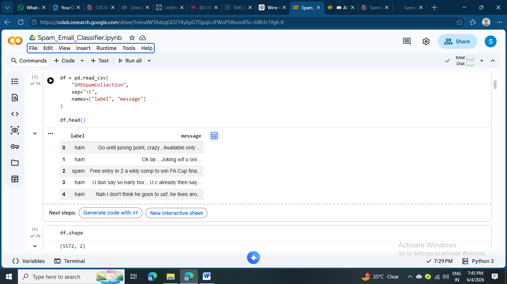
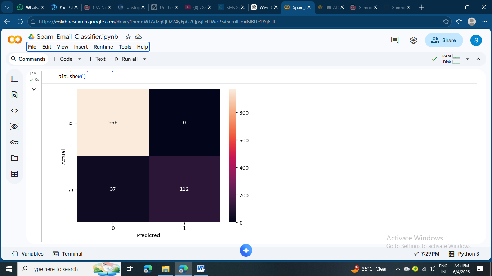
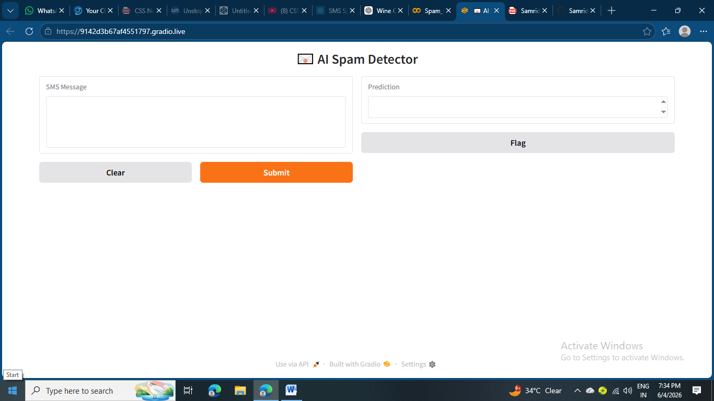

# 📧 Spam Email Classifier using NLP & Machine Learning

<p align="center">
  
  
  
  
  
</p>

<p align="center">
A Machine Learning project that classifies SMS messages as <b>Spam</b> or <b>Ham (Not Spam)</b> using Natural Language Processing techniques.
</p>

---

## 🚀 Project Overview

This project implements a complete NLP pipeline for spam detection using the **SMS Spam Collection Dataset (5,572 messages)**.

The workflow includes:

* Data Loading
* Text Preprocessing
* TF-IDF Vectorization
* Train/Test Split
* Multinomial Naive Bayes Classification
* Model Evaluation
* Interactive Gradio Web Interface

---

## 📂 Dataset

* **Dataset:** SMS Spam Collection
* **Total Messages:** 5,572
* **Classes:**

  * Ham (Normal Messages)
  * Spam (Promotional/Fraudulent Messages)

Example:

| Label | Message                                 |
| ----- | --------------------------------------- |
| Ham   | Hey, are we meeting tomorrow?           |
| Spam  | Congratulations! You won a free iPhone! |

---

## 🧠 Machine Learning Pipeline

```text
SMS Dataset
     │
     ▼
Data Cleaning
     │
     ▼
TF-IDF Vectorization
     │
     ▼
Train/Test Split
     │
     ▼
Multinomial Naive Bayes
     │
     ▼
Prediction
     │
     ▼
Evaluation Metrics
```

---

## 🛠️ Technologies Used

| Technology   | Purpose              |
| ------------ | -------------------- |
| Python       | Programming Language |
| Pandas       | Data Manipulation    |
| NumPy        | Numerical Computing  |
| Scikit-learn | Machine Learning     |
| Matplotlib   | Visualization        |
| Seaborn      | Statistical Plots    |
| NLTK         | NLP Preprocessing    |
| Gradio       | Interactive Web UI   |

---

## 📊 Model Performance

| Metric        | Score                   |
| ------------- | ----------------------- |
| Accuracy      | ~97%                    |
| Algorithm     | Multinomial Naive Bayes |
| Vectorization | TF-IDF                  |

The model was evaluated using:

* Accuracy Score
* Precision
* Recall
* F1-Score
* Confusion Matrix

---

## 🖥️ Demo

### Sample Input

```text
Congratulations! You have won a free iPhone. Claim your prize now!
```

### Prediction

```text
🚨 Spam
Confidence: 98.5%
```

---

## 📸 Screenshots

### Dataset Preview



### Confusion Matrix



### Gradio Interface



---

## 📁 Repository Structure

```text
spam-email-classifier/
│
├── Spam_Email_Classifier.ipynb
├── SMSSpamCollection
├── requirements.txt
├── README.md
└── screenshots/
    ├── dataset.png
    ├── confusion_matrix.png
    └── gradio_demo.png
```

---

## ⚙️ Installation

Clone the repository:

```bash
git clone https://github.com/YOUR_USERNAME/spam-email-classifier.git
```

Move into the project directory:

```bash
cd spam-email-classifier
```

Install dependencies:

```bash
pip install -r requirements.txt
```

Launch the notebook:

```text
Spam_Email_Classifier.ipynb
```

Run all cells sequentially.

---

## 🎯 Future Improvements

* Email spam detection
* Explainable AI (important word highlighting)
* Hugging Face Spaces deployment
* Multi-language spam detection
* Deep Learning (LSTM/BERT) version

---

## 👨‍💻 Author

**Samriddhi Dua**

Aspiring Software Engineer | Web Developer | Machine Learning Enthusiast

---

### ⭐ If you found this project useful, consider giving it a star!
